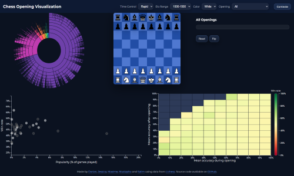

# ChessViz

## Contributors

+ [Dorian TONNIS](https://www.linkedin.com/in/dorian-tonnis/)
+ [Jessica NDIAYE](https://www.linkedin.com/in/ndiaye-jessica-a451592b6/)
+ [Maxime ANTOINE](https://www.linkedin.com/in/maxime-antoine-pro/)
+ [Mustapha EL ABRIDI](https://www.linkedin.com/in/mustapha-el-abridi-987a23254/)
+ [Salim CHABCHOUB](https://www.linkedin.com/in/salim-chabchoub-a6200b224/)

## About



This project focuses on the analytical study of chess openings. See [about.html](about.html) for more details on the project context and problematics.

The project was developed as part of the [Data Visualization](https://lyondataviz.github.io/teaching/lyon1-m2/2025/) course at Claude Bernard University Lyon 1.

## Dataset

The dataset used in this project is sourced from [Lichess.org](https://database.lichess.org/), a popular online chess platform. It contains detailed records of chess games played on the platform, including information about openings, player ratings, and game outcomes.

## Visualization

The visualizations were created using [D3.js](https://d3js.org/). They aim to provide insights into the effectiveness of different chess openings and their impact on game results. All visualizations are linked together to allow for interactive exploration of the data.

Voici **la même section traduite en anglais**, avec un ton clair et académique, prête à être intégrée directement dans ton `README.md` :


##  Project Structure

```text
chess-viz/
├── css/                  # Application CSS styles
├── data/                 # Final datasets used by the visualizations
├── data_processing/      # Python scripts for data parsing and generation
├── img/                  # Images and graphical assets
├── js/                   # JavaScript files (D3.js & front-end logic)
├── index.html            # Main visualization page
├── about.html            # Project context, problem statement and explanations
├── readme.md             # Project documentation
```


##  Data Processing (`data_processing/`)

This directory contains the **entire data processing pipeline**, from raw game files to the final JSON files consumed by D3.js.

```text
data_processing/
├── main.py               # Entry point of the data processing pipeline
├── parser/               # PGN parsing and game handling
├── parsed/               # Intermediate data (Parquet format)
├── builder/              # Aggregated dataset construction
│   ├── base.py           # Base class for all builders
│   ├── registry.py       # Central builder registry
│   ├── openings.py       # Opening-related logic
│   └── builders/         # Visualization-specific builders
├── json/                 # Final JSON outputs for the front-end
```

###  `parser/`

* Loading and parsing Lichess PGN files
* Extraction of openings, results, ELO ratings, and player colors
* Data normalization and cleaning

###  `builders/`

Each builder corresponds to **a specific visualization**:

* `opening_accuracy_heatmap_builder.py`
* `opening_explorer_builder.py`
* `popularity_builder.py`

These scripts generate the JSON files consumed by D3.js.


##  Data (`data/`)

**Ready-to-use datasets** for the front-end visualizations.

```text
data/
├── accuracy.json
├── openingExplorer.json
└── popularity.json
```

Each file corresponds to a specific visualization.


##  Front-end (`js/`)

This directory contains **all interactive and graphical logic**, built using **D3.js**.

```text
js/
├── Visualization.js                 # Abstract base class for all visualizations
├── PopularityVisualization.js       # Opening popularity vs win rate
├── AccuracyVisualization.js         # Accuracy heatmap
├── OpeningExplorerVisualization.js  # Interactive opening exploration
├── OpeningExplorerState.js          # Global state and filters management
├── Chessboard.js                    # Chessboard rendering
├── openings.js                      # Static opening-related data
└── script.js                        # JavaScript entry point
```

### Architecture

* `Visualization.js` defines:

  * SVG structure
  * axis management
  * tooltips
  * transitions
* Each visualization inherits from this base class
* All visualizations are **linked through shared filters**


## Styles (`css/`)

```text
css/
├── style.css          # Global styles
├── chessboard.css     # Chessboard-specific styles
└── about.css          # Project presentation page styles
```


##  Assets (`img/`)

```text
img/
└── pieces/            # Chess piece images used on the board
```


##  Data Flow

```text
Lichess PGN
   ↓
Parser (Python)
   ↓
Builders (aggregation)
   ↓
JSON files
   ↓
D3.js Visualizations
```


##  Design Choices

* Clear separation between **data processing** and **visualization**
* Reproducible and modular processing pipeline
* Linked visualizations to support interactive exploration
* Statistical filtering (minimum number of games) to reduce noise


